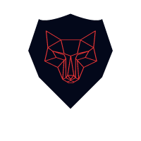

# BlueTeam
Building a SOC for my home network  🛡️🗡️


## SOC + tunnel

Follow steps in [K8](k8/)

# PiHole

Your own DNS server. Solves hostname issues to route into the K8 cluster.

# Wolf-Soc

Various SOC tools from ticketing system to CTI platform basked into a docker-compose.

<!--
Docker for all your needs.

```bash
cd wolfSOC/
docker compose up -d 
```

Wait everything to be ready.
Go to Cortex, create the API key. 
Then:

```bash
docker compose down

chmod 777 -Rc ./*
chmod 777 -c $job_directory
```

Now that you have write access, adjust the config file in `wolfSOC/thehive` and your containers can write into their `$job_directory`.

Now up again, happy hunting!🏹
```bash
docker compose up
```


